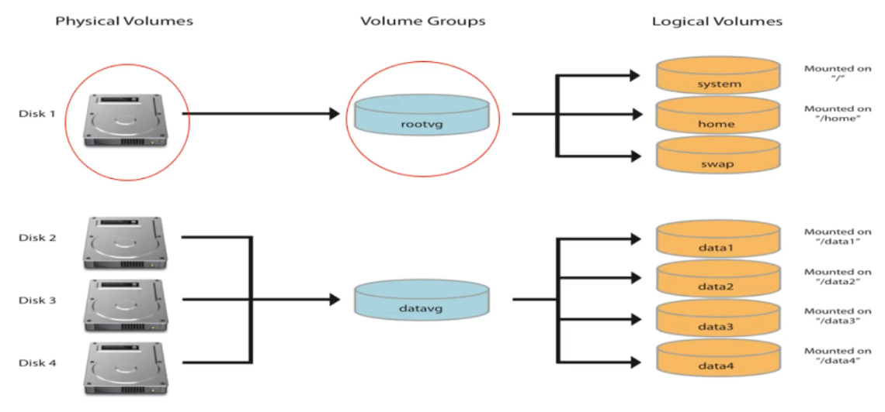

# RH134

## Improve CMD line productivity

## Crontab & at

```Shell
# User specific crontab
crontab -e # to edit
crontab -l # to list

run-parts /etc/cron.hourly
```

## Tune system performance

```Shell
tuned
tuned-adm list # To list profiles

# Top
# PR System value
# NI Nice value modifiable by user
nice -n -15 top
renice -n 0 PID
```

## ACL

```Shell
setfacl -m u:user:rw /path/to/file # for user
setfacl -m g:group:rw /path/to/file # for group

getfacl /path/to/file # retrieve permissions

setfacl -Rm u:user:rw /path/to/folder

setfacl -x u:user /path/to/file # Remove ACLs for a specific user

setfacl -b /path/to/file # Remove all ACL's
```

## SELinux

```Shell
setenforce
getenforce

user:role:type:level

getsebool -a
selinux boolean -l

setsebool -P boolean_name on

# Show SELinux errors
journalctl

# Change labels
chcon -t httpd_sys_conent_t filename

semanage fcontext -m -t httpd_sys_conent_t filename
```

## Storage

### Mount a disk

/etc/fstab

```Shell
# dev/sdb1  /data   xfs     defaults    0 2
device
mount point
file system type
mount options (noauto, user, nofail, defaullts(rw, suid, dev, exec, auto, nouser, async))
0 (dump, which fs need to be dumped) 
2 (fs check 1 for root partition, 2 for others, 0 no check)
```

### LVM



```Shell
lsblk
lsblk -f # fs type
lsblk -o name,size,fstype

# Create PV
pvcreate /dev/sdb
pvdisplay

# Create PV 2
fdisk /dev/sdc
pvcreate /dev/sdc1 /dev/sdc2
pvscan
pvremove

# Create VG
vgcreate lvm1 /dev/sdb /dev/sdc1
vgdisplay
vgscan

# Extend / Reduce VG by a physical volume
vgextend lvm1 /dev/sdc2
vgreduce lvm1 /dev/sdc2
vgremove lvm1

# Logical Volumes
lvcreate -L size -n name vgname
lvreate -L 8G -n lv1 lvm1

lvcreate -l 60%VG -n lv2 lvm2
lvcreate -l 100%FREE -n lv2 lvm2

lvscan

mkfs.ext4 /dev/lvm1/lv1
mount -t ext4 /dev/lvm1/lv1 /mnt

lvresize -L +2GB /dev/lvm1/lv1
resize2fs /dev/lvm1/lv1

lvreduce -r -L -1G dev/lvm1/lv1 # with resizefs

xfs_grofs /dev/lvm2/lv1
```

## Advanced storage features

```Shell
# Stratis ???

```

## NFS

```Shell

```

man -k lvcreate
info pages

RHCSA 9 cert guide ESX200 sander van vaught
reset root passwork using init=/bin/bash instead of rd.break
asghar ghori RH 9 EX 200

suvpuw-xuksob-3byjvY